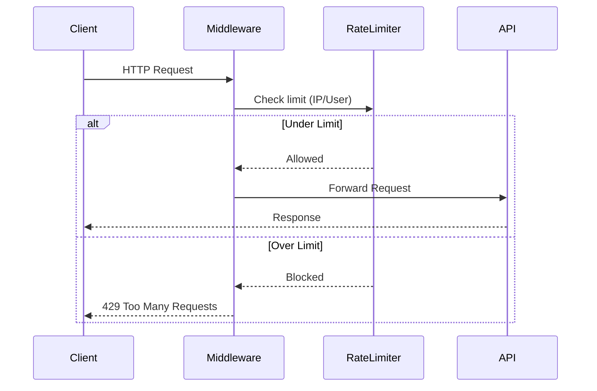

# Design Document: Platform Improvements

## Overview

Dit design document beschrijft de technische architectuur voor het verbeteren van het StreamIt platform. De verbeteringen focussen op drie pijlers: type safety (TypeScript), betrouwbaarheid (testing), en beveiliging (rate limiting, validatie, security headers).

De implementatie volgt een incrementele aanpak waarbij bestaande JavaScript code gradueel wordt gemigreerd naar TypeScript, terwijl nieuwe functionaliteit direct in TypeScript wordt geschreven.

## Architecture

### High-Level Architecture

```
┌─────────────────────────────────────────────────────────────────┐
│                        Next.js Application                       │
├─────────────────────────────────────────────────────────────────┤
│  ┌─────────────┐  ┌─────────────┐  ┌─────────────────────────┐  │
│  │   Pages/    │  │    API      │  │      Middleware         │  │
│  │ Components  │  │   Routes    │  │  (Rate Limit, Auth)     │  │
│  └──────┬──────┘  └──────┬──────┘  └───────────┬─────────────┘  │
│         │                │                      │                │
│  ┌──────▼────────────────▼──────────────────────▼─────────────┐ │
│  │                    Validation Layer (Zod)                   │ │
│  └──────┬────────────────┬──────────────────────┬─────────────┘ │
│         │                │                      │                │
│  ┌──────▼──────┐  ┌──────▼──────┐  ┌───────────▼─────────────┐  │
│  │   Hooks     │  │    Lib      │  │      Store (Zustand)    │  │
│  │  (typed)    │  │  (typed)    │  │        (typed)          │  │
│  └─────────────┘  └──────┬──────┘  └─────────────────────────┘  │
│                          │                                       │
│  ┌───────────────────────▼───────────────────────────────────┐  │
│  │                  Prisma Client (auto-typed)                │  │
│  └───────────────────────┬───────────────────────────────────┘  │
└──────────────────────────┼───────────────────────────────────────┘
                           │
                    ┌──────▼──────┐
                    │   SQLite    │
                    │   Database  │
                    └─────────────┘
```

### Rate Limiting Flow



## Components and Interfaces

### 1. TypeScript Type Definitions

```typescript
// src/types/index.ts
export interface User {
  id: string;
  email: string;
  name: string | null;
  image: string | null;
}

export interface Stream {
  id: string;
  title: string;
  type: 'RTMP' | 'STUDIO';
  status: 'DRAFT' | 'LIVE' | 'ENDED';
  userId: string;
  rtmpKey: string | null;
  brandColor: string | null;
  createdAt: Date;
  updatedAt: Date;
}

export interface ApiResponse<T> {
  data?: T;
  error?: string;
  details?: ValidationError[];
}

export interface ValidationError {
  path: string[];
  message: string;
}
```

### 2. Validation Schemas (Zod)

```typescript
// src/lib/validations/stream.ts
import { z } from 'zod';

export const createStreamSchema = z.object({
  title: z.string()
    .min(1, 'Title is required')
    .max(100, 'Title must be 100 characters or less'),
  type: z.enum(['RTMP', 'STUDIO']),
  description: z.string().max(500).optional(),
});

export const updateStreamSchema = createStreamSchema.partial();

export type CreateStreamInput = z.infer<typeof createStreamSchema>;
export type UpdateStreamInput = z.infer<typeof updateStreamSchema>;
```

### 3. Rate Limiter Interface

```typescript
// src/lib/rate-limit.ts
export interface RateLimitConfig {
  windowMs: number;      // Time window in milliseconds
  maxRequests: number;   // Max requests per window
}

export interface RateLimitResult {
  success: boolean;
  remaining: number;
  resetAt: Date;
}

export interface RateLimiter {
  check(identifier: string): Promise<RateLimitResult>;
  reset(identifier: string): Promise<void>;
}
```

### 4. Logger Interface (TypeScript)

```typescript
// src/lib/logger.ts
export interface LogContext {
  [key: string]: unknown;
}

export interface Logger {
  error(message: string, error?: Error | LogContext): void;
  warn(message: string, context?: LogContext): void;
  info(message: string, context?: LogContext): void;
  debug(message: string, context?: LogContext): void;
}
```

## Data Models

### Validation Schema Types

```typescript
// Zod schema output types worden automatisch gegenereerd
// en zijn consistent met de Prisma types

// Stream validation
const streamSchema = z.object({
  title: z.string().min(1).max(100),
  type: z.enum(['RTMP', 'STUDIO']),
  status: z.enum(['DRAFT', 'LIVE', 'ENDED']).optional(),
});

// Platform validation  
const platformSchema = z.object({
  platform: z.enum(['youtube', 'twitch', 'facebook', 'linkedin']),
  streamKey: z.string().min(10).max(200),
  isConnected: z.boolean(),
});

// Rate limit tracking (in-memory)
interface RateLimitEntry {
  count: number;
  windowStart: number;
  identifier: string;
}
```

### Security Headers Configuration

```typescript
// next.config.ts headers configuration
const securityHeaders = [
  {
    key: 'X-Frame-Options',
    value: 'DENY',
  },
  {
    key: 'X-Content-Type-Options', 
    value: 'nosniff',
  },
  {
    key: 'Referrer-Policy',
    value: 'strict-origin-when-cross-origin',
  },
  {
    key: 'X-XSS-Protection',
    value: '1; mode=block',
  },
];
```


## Correctness Properties

*A property is a characteristic or behavior that should hold true across all valid executions of a system-essentially, a formal statement about what the system should do. Properties serve as the bridge between human-readable specifications and machine-verifiable correctness guarantees.*

Based on the prework analysis, the following correctness properties have been identified:

### Property 1: Title Length Validation

*For any* string input as stream title, the validation schema SHALL accept the input if and only if the string length is between 1 and 100 characters (inclusive), and reject all other inputs with an appropriate error message.

**Validates: Requirements 2.2**

### Property 2: StreamKey Format Validation

*For any* string input as platform streamKey, the validation schema SHALL accept the input if and only if it matches the expected format for the specified platform (minimum 10 characters, maximum 200 characters, alphanumeric with allowed special characters), and reject all other inputs.

**Validates: Requirements 2.4**

### Property 3: Validation Error Round-Trip

*For any* validation error object produced by the Zod schema, serializing the error to JSON and parsing it back SHALL produce an equivalent error object with the same path and message information.

**Validates: Requirements 2.5, 2.6**

### Property 4: Rate Limit Threshold Enforcement

*For any* IP address and any sequence of N requests within a 10-second window, if N > 10 then the (N+1)th request SHALL receive a 429 status code, regardless of the timing distribution of the previous requests within the window.

**Validates: Requirements 3.1**

### Property 5: Rate Limit Retry-After Header

*For any* rate-limited response (429 status), the response SHALL include a Retry-After header with a positive integer value representing seconds until the rate limit window resets.

**Validates: Requirements 3.2**

### Property 6: Authenticated Rate Limit Advantage

*For any* authenticated user and any anonymous user making the same sequence of requests, the authenticated user SHALL be able to make more requests before being rate-limited than the anonymous user.

**Validates: Requirements 3.3**

### Property 7: Validation Schema Consistency

*For any* input value, the validation schema SHALL produce a deterministic result - either always accept or always reject that specific input, regardless of when or how many times validation is performed.

**Validates: Requirements 5.3**

### Property 8: Rate Limit Order Independence (Confluence)

*For any* set of N requests from the same IP address within a time window, the final rate limit state (whether the IP is blocked or not) SHALL be the same regardless of the order in which the requests arrive.

**Validates: Requirements 5.4**

## Error Handling

### Validation Errors

```typescript
// src/lib/errors.ts
export class ValidationError extends Error {
  constructor(
    public readonly errors: Array<{ path: string[]; message: string }>,
    message = 'Validation failed'
  ) {
    super(message);
    this.name = 'ValidationError';
  }

  toJSON() {
    return {
      error: this.message,
      details: this.errors,
    };
  }

  static fromZodError(zodError: z.ZodError): ValidationError {
    return new ValidationError(
      zodError.errors.map(e => ({
        path: e.path.map(String),
        message: e.message,
      }))
    );
  }
}
```

### Rate Limit Errors

```typescript
export class RateLimitError extends Error {
  constructor(
    public readonly retryAfter: number,
    public readonly identifier: string
  ) {
    super('Too many requests');
    this.name = 'RateLimitError';
  }

  toResponse(): NextResponse {
    return NextResponse.json(
      { error: 'Too many requests', retryAfter: this.retryAfter },
      { 
        status: 429,
        headers: { 'Retry-After': String(this.retryAfter) }
      }
    );
  }
}
```

### API Error Handler

```typescript
// src/lib/api-handler.ts
export function withErrorHandler<T>(
  handler: (req: Request) => Promise<NextResponse<T>>
) {
  return async (req: Request): Promise<NextResponse> => {
    try {
      return await handler(req);
    } catch (error) {
      if (error instanceof ValidationError) {
        return NextResponse.json(error.toJSON(), { status: 400 });
      }
      if (error instanceof RateLimitError) {
        return error.toResponse();
      }
      logger.error('Unhandled API error', error as Error);
      return NextResponse.json(
        { error: 'Internal server error' },
        { status: 500 }
      );
    }
  };
}
```

## Testing Strategy

### Dual Testing Approach

Deze implementatie gebruikt zowel unit tests als property-based tests:

- **Unit tests** verifiëren specifieke voorbeelden, edge cases en error condities
- **Property tests** verifiëren universele eigenschappen die voor alle inputs moeten gelden
- Samen bieden ze comprehensive coverage: unit tests vangen concrete bugs, property tests verifiëren algemene correctheid

### Testing Framework

- **Test Runner**: Vitest (modern, fast, Vite-compatible)
- **Property-Based Testing**: fast-check (mature PBT library voor JavaScript/TypeScript)
- **React Testing**: @testing-library/react
- **Minimum iterations**: 100 per property test

### Test File Structure

```
src/
├── lib/
│   ├── validations/
│   │   ├── stream.ts
│   │   └── stream.test.ts          # Unit + Property tests
│   ├── rate-limit.ts
│   └── rate-limit.test.ts          # Unit + Property tests
└── test/
    ├── setup.ts                     # Test configuration
    └── helpers/
        └── generators.ts            # fast-check generators
```

### Property Test Annotation Format

Elke property-based test MOET worden geannoteerd met een comment die refereert naar de correctness property:

```typescript
/**
 * **Feature: platform-improvements, Property 1: Title Length Validation**
 * **Validates: Requirements 2.2**
 */
it.prop([fc.string()])('accepts valid titles and rejects invalid ones', (input) => {
  const result = createStreamSchema.shape.title.safeParse(input);
  const isValidLength = input.length >= 1 && input.length <= 100;
  expect(result.success).toBe(isValidLength);
});
```

### Unit Test Examples

```typescript
// Stream validation unit tests
describe('createStreamSchema', () => {
  it('accepts valid stream input', () => {
    const input = { title: 'My Stream', type: 'RTMP' };
    expect(createStreamSchema.safeParse(input).success).toBe(true);
  });

  it('rejects empty title', () => {
    const input = { title: '', type: 'RTMP' };
    const result = createStreamSchema.safeParse(input);
    expect(result.success).toBe(false);
  });

  it('rejects title over 100 characters', () => {
    const input = { title: 'a'.repeat(101), type: 'RTMP' };
    const result = createStreamSchema.safeParse(input);
    expect(result.success).toBe(false);
  });
});
```

### Coverage Goals

| Category | Target Coverage |
|----------|----------------|
| Utility functions (src/lib/) | 70%+ |
| Validation schemas | 90%+ |
| API route handlers | 60%+ |
| React components | 50%+ |

### Test Configuration

```typescript
// vitest.config.ts
import { defineConfig } from 'vitest/config';
import react from '@vitejs/plugin-react';
import path from 'path';

export default defineConfig({
  plugins: [react()],
  test: {
    environment: 'jsdom',
    globals: true,
    setupFiles: ['./src/test/setup.ts'],
    coverage: {
      provider: 'v8',
      reporter: ['text', 'html'],
      exclude: ['node_modules/', 'src/test/'],
    },
  },
  resolve: {
    alias: {
      '@': path.resolve(__dirname, './src'),
    },
  },
});
```
